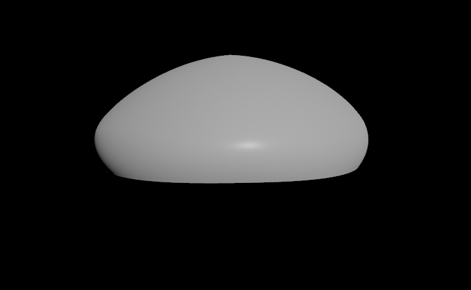
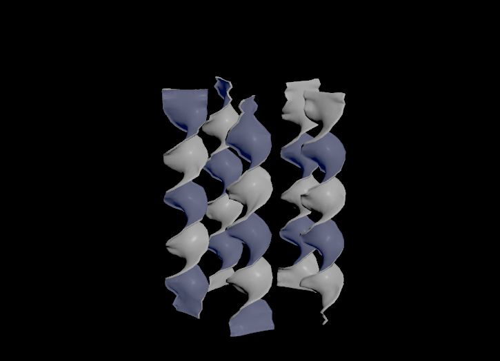
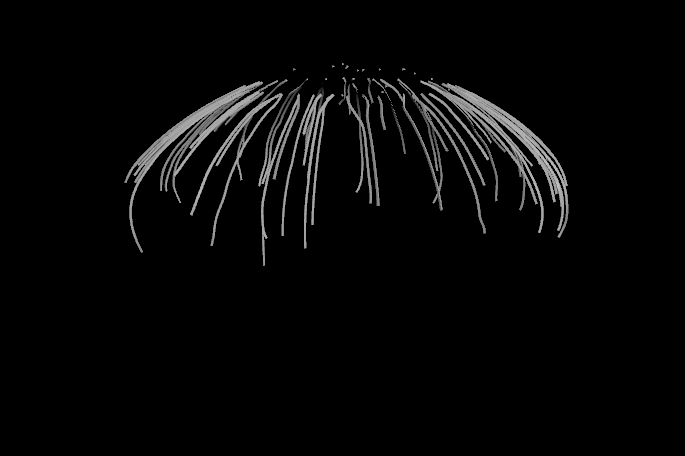
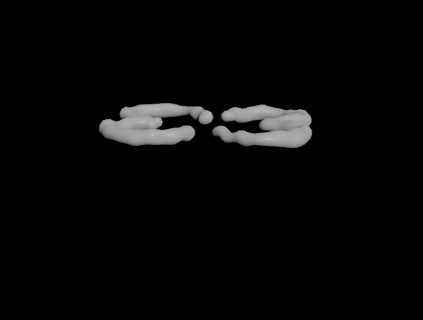
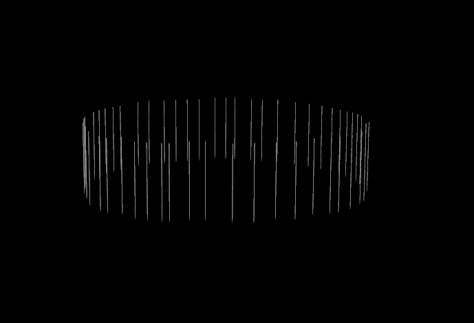

# Procedural Jellyfish

## Project Overview
The project shows a procedural jellyfish using Houdini. The jellyfish is broke parts into bell, arms, veins, organs, and tentacles. After procedurally building their shape, some vellum simulations are applied to provide a realized animation.

Rendering:

Viewport:

## Development

